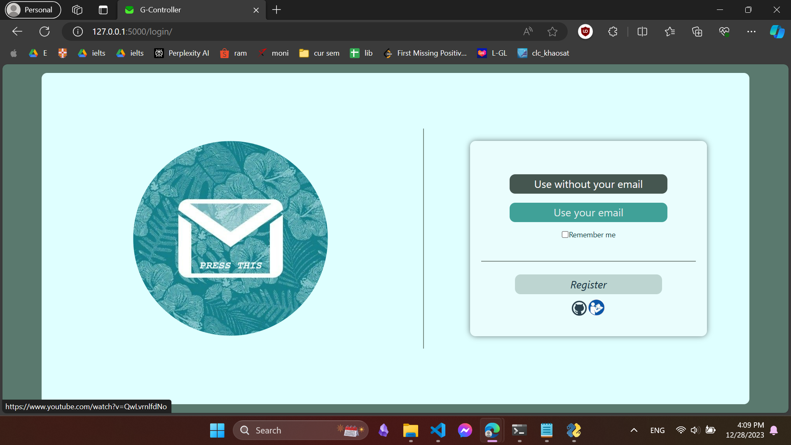
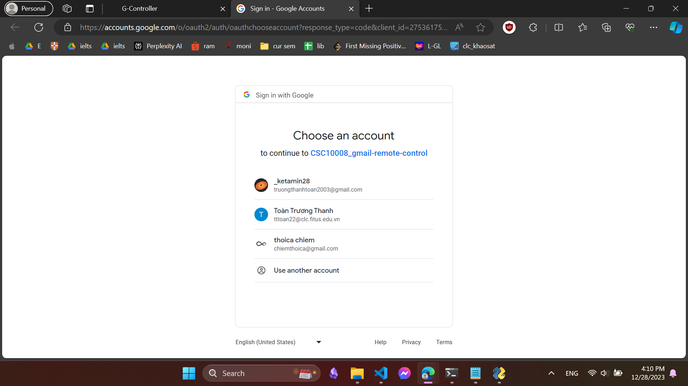
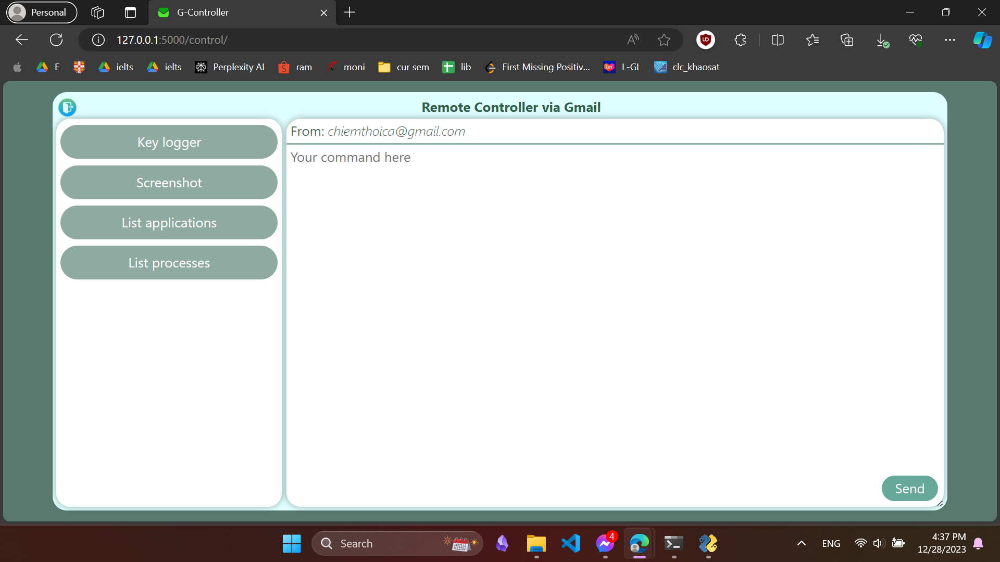
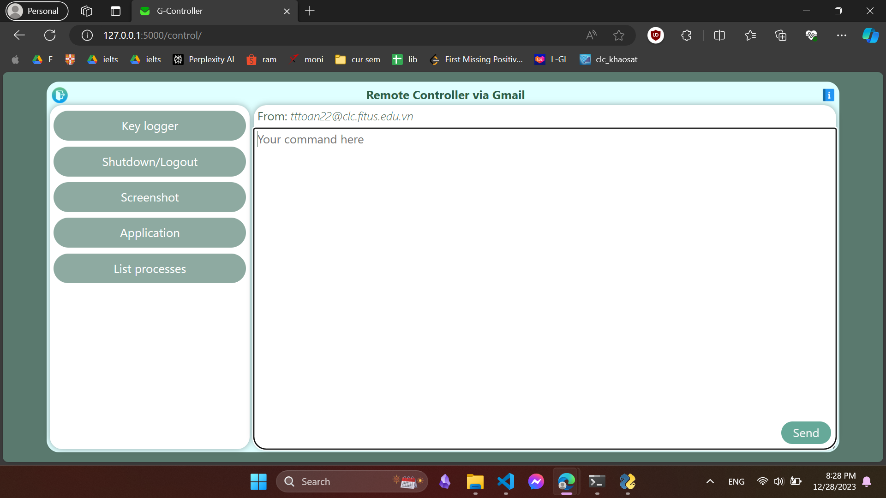
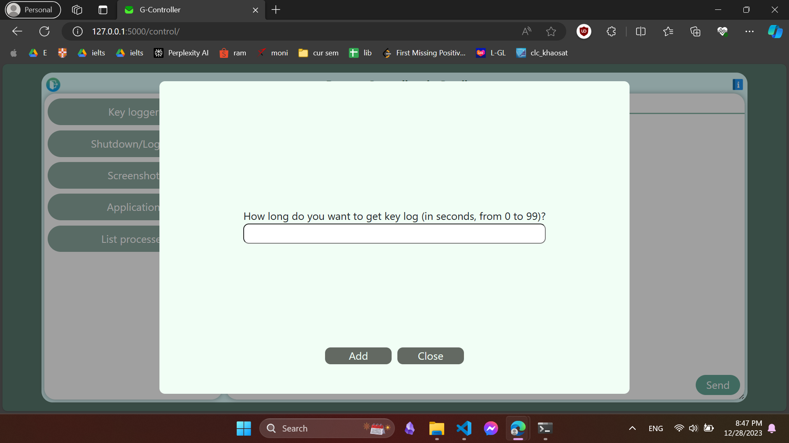

## Table of contents
- [Table of contents](#table-of-contents)
- [About us](#about-us)
- [About this project](#about-this-project)
  - [Introduction](#introduction)
  - [Demo video](#demo-video)
  - [Screenshots](#screenshots)
- [How to use?](#how-to-use)
## About us
- 22127488 - [Truong Thanh Toan](https://github.com/ketamean)
- 22127459 - [Pham Thanh Vinh](https://github.com/vicyan1611)
- 22127101 - [Ly Ngoc Han](https://github.com/FlyingCat2703)
- 22127254 - [Truong Nguyen Hien Luong](https://github.com/gnoulh)

## About this project
- This project is an application that helps you to request server to do some certain tasks and then receive responses. The process of sending and receiving package are supported by Gmail.
### Introduction
- Client: sends commands via Google Mail to server, then receives and donwloads response to local computer.
- Server: reads mails from clients, processes and returns the result to them. 
### Demo video
Check out our [demo video](https://youtu.be/DMN8exwKQ9k) on youtube to see the application's behaviour.
### Screenshots
- Login page

- OAuth authentication and authorization

- Anonymous control

- Control with your own gmail

- Key logger

## How to use?
- Prerequisite:
  - Python: this application is perfectly run on python 3.12.0 and later
1. Choose an empty folder on your device, right-click and choose *Open in Terminal*.
2. Paste this to terminal:
    ```
    git clone https://github.com/ketamean/CSC10008_gmail-remote-control.git
    ```
3. Open the chosen folder in file explorer.
4. Start the server:
   - Double-click on `run_server.cmd`.
   - To start receiving messages, choose *Start*.
   - To stop receiving messages, choose *Stop*.
   - To halt and close the app, choose *Exit*. This action will simultaneously exit the batch (which means you do not need to manually terminate the batch on terminal).
5. After starting server, now you can open client-side app at anytime as long as the server is alive:
   - Double-click on `run_client.cmd`.
   - There will be an http link to be run locally on your web browser. The link should be in the format `http://127.0.0.1:PORT`, where `PORT` usually is `5000`.
   - There are 2 options: <u>*anonymous mode*</u> (without loging in your gmail acocunt) and <u>*logged-in mode*</u> (you must log in to your gmail account to use)
      - <u>*Disclaimer*</u>: we do **NOT** collect your password as we get the authorization via OAuth2.0.
      - Within using this app ***anonymously***, you will be prevented from using 4 features:
           - Shut down server.
           - Log out server.
           - Start an application on server.
           - Close an application on server.
      - When using this app in ***logged-in mode***, you will have an accessibility to all of our features.
           - However, to obtain this, you firstly are forced to register your gmail address to the server by clicking on *Register* button.
           - Without having been registered, you **cannot** log in to our application.
      - After using the app, please remember to terminate the batch by press `Ctrl + C` on the terminal displayed after clicking on `run_client.cmd`. If don't, the port on which this app is running will be occupied until the device is restarted.
6. Notes:
   - Although we do not collect your gmail account's password, we do need you to allow us to access to your mails in your mailbox. It essential to inform that, we only access to mails that match our convention with particular mail subjects, and we will not manually traverse your mailbox ourselves but we will obtain these within the help of Gmail API (query).
   - If you terminate any processes yourself, you will not receive any results. However, you can still achieve what you want in case you these 3 things simutaneously occur:
     - You are registering your account to our application
     - You have SUCCESSFULLY LOGGED IN (which means you have already sent an email to server to register your account)
     - Your account is accepted by server